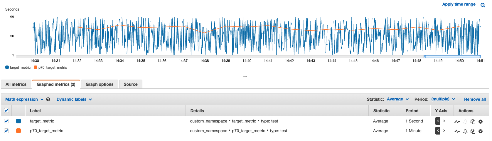

# cw_lambda_publisher
This is a sample repo. It allows to generate a random custom CW metric (random in from [1,100] interval) from your local box. This metric resolution is 1 second. At the same time, it deploys periodic Lambda which will take a P70 of random metric every minute and publishes it as separate P70 custom metric (with 1 minute resolution). 

# How to use this sample

## Setup
- have AWS CLI configured;
- install serverless.com: `npm install -g serverless`;
- install required python libraries via `pip install -r requirements.txt -t vendored`;

## Running
- start on your local box metric generation: `python metric_generator.py `
- deploy Lambda in the cloud via `serverless deploy`
- observe custom metric and P70 custom metric published in CloudWatch. Expected picture:

